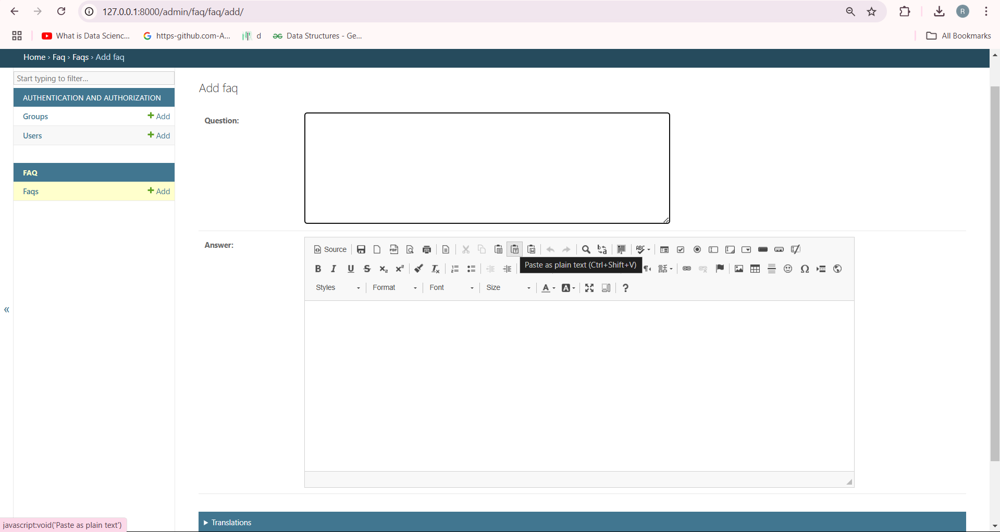

# Multilingual FAQ System

A Django-based system to manage Frequently Asked Questions (FAQs) with multilingual support using `django-ckeditor`, `googletrans`, and `Redis` for caching. This system provides an easy-to-use admin interface, an efficient REST API, and integrates Google Translate for generating translations.

## Features

1. **FAQ Management**: Store FAQs with a question and answer in multiple languages.
2. **WYSIWYG Editor**: Use the `django-ckeditor` editor to format answers properly.
3. **Multilingual Support**: Supports FAQs in multiple languages including Hindi, Bengali, and Telugu.
4. **Caching Mechanism**: Caches translations using Redis to improve performance.
5. **REST API**: Provides a REST API to create, retrieve, and manage FAQs, with support for language selection via query parameters.
6. **Unit Testing**: Includes unit tests using `pytest` to verify model creation, translation retrieval, and API responses.
7. **Admin Panel**: Easy-to-use admin panel for managing FAQs.
8. **Containerization**: The application is containerized using Docker for simplified deployment and scalability.

## Installation

### Prerequisites
- Python 3.8+
- Django 4.x+
- Redis (for caching)

### Steps to Install

1. Clone the repository:
   ```bash
   git clone https://github.com/yourusername/faq-multilingual-django.git
   cd faq-multilingual-django
   ```
2. Create a virtual environment :
  ```bash 
    python -m venv venv
    source venv/bin/activate  # For Windows use `venv\Scripts\activate`
  ```
3. Install the dependencies:
  ```bash 
    pip install -r requirements.txt
   ```
4. Install Redis and start the Redis server : 
  
  ```bash 
  # For Windows 
  docker run --name faq_redis -p 6379:6379 -d redis # faq_redis to custom name

  ```
5. Run migrations to set up the database:
  ```bash
  python manage.py migrate
  ```
6. Run the collectstatic command to collect static files:
  ```bash
     python manage.py collectstatic  #Ensure static file present root directory
   ```
7. Create a superuser to access the admin panel:
  ```bash 
   python manage.py createsuperuser
   ```
8. Start the Django development server:
  ```bash
   python manage.py runserver
   ```
9. Visit http://localhost:8000/admin to log in to the admin panel and manage FAQs.




## API Usage 
## GET /api/faqs/
Fetch FAQs in the requested language (default is English).
####  Example
```bash 
GET http://localhost:8000/api/faqs/?lang=hi
```
#### Response:   
```bash    
[
    {
        "id": 1,
        "en": {
            "question": "What is Django?",
            "answer": "Django is a Python web framework."
        },
        "hi": {
            "question": "Django क्या है?",
            "answer": "Django एक पायथन वेब फ्रेमवर्क है।"
        }
    }
]
```
## POST /api/faqs-create/
Create a new FAQ
####  Example
```bash 
POST http://localhost:8000/api/faqs-create/
```
#### Request body:
```bash
{
    "question": "What is Python?",
    "answer": "Python is a programming language."
}
```
#### Response:
```bash
{
    "message": "FAQ created successfully!",
    "data": {
        id": 5b43f1b1-8f4e-4a7e-b6b5-2c487e58a7e1,
        "created_at": "2025-02-02T11:12:23.412311Z",
        "en": {
            "question": "What is Python?",
            "answer": "Python is a programming language."
        }
    }
}
```

# Caching 
Translations are cached in Redis for one hour to improve performance. When a translation is requested, the cache is checked before querying Google Translate.
# Unit Tests 
Run the following command to execute the unit tests:
```bash
pytest
```
# Code Quality
We follow the PEP8 coding standards, and the code is linted using flake8.
To check for linting issues, run:
```bash 
flake8 .
```


# Deployment & Docker Support
The application is containerized using Docker for easy deployment. This makes it easy to run the application in any environment that supports Docker.
### Docker Setup

1. Ensure you have Docker installed.
2. Build and Run the Containers Use Docker Compose to build and start the containers:
```bash 
docker-compose up --build
```
3. Visit the application at http://localhost:8000.

# Depolyment 
The app can be deployed on Heroku or AWS for production. A Dockerfile and docker-compose.yml are included for seamless deployment.
#### Note 
 I didn't depolyed the application due my AWS account suspended and Account creation issues in Heroku
